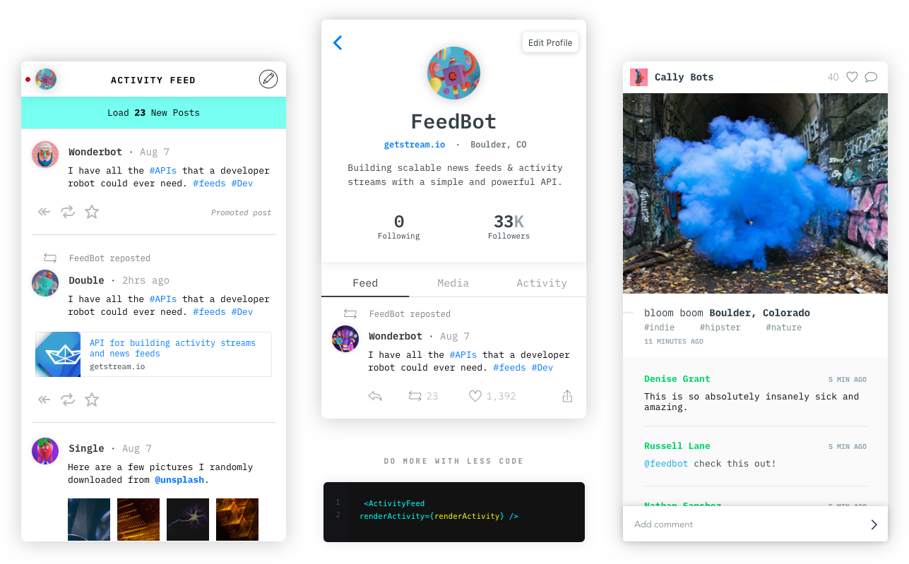

# Official React Native SDK for [Activity Feeds](https://getstream.io/activity-feeds/)

> React Native components to create activity and notification feeds using Stream

[](https://www.npmjs.com/package/react-native-activity-feed)
[](https://travis-ci.org/GetStream/react-native-activity-feed)
[](https://getstream.github.io/react-native-activity-feed/)



The official React Native integration library for Stream, a web service for
building scalable newsfeeds and activity streams.

## TL;DR built-in components for social networks and regular apps

- Flat feeds
- Timelines and Newsfeeds
- Notification feed
- Likes
- Comments
- Activity detail view
- Realtime notifications

## 🔗 Quick Links

- [Get Started](https://getstream.io/react-native-activity-feed/tutorial/)
- [Example app](https://github.com/GetStream/react-native-example#react-native-activity-feed-example)
- [Component reference docs](https://getstream.github.io/react-native-activity-feed/)
- [Internationalisation (i18n)](https://getstream.github.io/react-native-activity-feed/#internationalisation-i18n)

## 🔐 React Native Compatibility

To use this library you need to ensure you match up with the correct version of React Native you are using.

| `react-native-activity-feed` version | [`getstream`](https://www.npmjs.com/package/getstream) | react-native |
| ------------------------------------ | ------------------------------------------------------ | ------------ |
| `1.x.x`                              | `>= 0.6.x`                                             | `>= 0.60.0`  |
| `0.x.x`                              | `< 0.6.0`                                              | `< 0.60.0`   |

## 🔮 Example Apps

- [Expo example](https://github.com/GetStream/react-native-activity-feed/tree/master/examples/expo#expo-example)
- [Native example](https://github.com/GetStream/react-native-activity-feed/tree/master/examples/native#native-example)
- [Complete social networking app](https://github.com/GetStream/react-native-example#react-native-activity-feed-example)

## 🛠 Installation

### Expo package

```sh
# For Expo apps
expo install expo-activity-feed expo-permissions expo-image-picker

```

### Native package

```sh
# For apps with native code
yarn add react-native-activity-feed react-native-image-crop-picker
npx pod-install
```

**Note** If you are planning to use the image picker functionality, there are some additional steps to be done.
You can find them here - https://github.com/ivpusic/react-native-image-crop-picker/blob/v0.25.0/README.md#post-install-steps

## 🔌 Usage & Activity Feed setup

### Setup StreamApp component

In order to use Stream React Components in your application, you first need to initialize the `StreamApp` component. `StreamApp` holds your application config and acts as a service/data provider.

```jsx
<StreamApp
  apiKey='{API_KEY}'
  appId='{APP_ID}'
  userId='{USER_ID}'
  token='{TOKEN}'
  analyticsToken='{ANALYTICS_TOKEN}'
>
  {/* everything from your application interacting with Stream should be nested here */}
</StreamApp>
```

1. **API_KEY** your Stream application API_KEY
2. **API_ID** your Stream application ID
3. **USER_ID** current user's ID
4. **TOKEN** the authentication token for current user
5. **ANALYTICS_TOKEN** [optional] the Analytics auth token

You can find your `API_KEY` and `APP_ID` on Stream's dashboard.

#### Generating user token

The authentication user token cannot be generated client-side (that would require sharing your API secret). You should provision a user token as part of the sign-up / login flow to your application from your backend.

```js
const client = stream.connect(API_KEY, API_SECRET);
const userToken = client.createUserToken(userId);
console.log(userToken);
```

#### Generating analytics token

React components have analytics instrumentation built-in, this simplifies the integration with Stream. In order to enable analytics tracking, you need to initialize `StreamApp` with a valid analytics token. You can generate this server-side as well.

```js
const client = stream.connect(API_KEY, API_SECRET);
const analyticsToken = client.getAnalyticsToken();
console.log(analyticsToken);
```

## Copyright and License Information

Copyright (c) 2015-2019 Stream.io Inc, and individual contributors. All rights reserved.

See the file "LICENSE" for information on the history of this software, terms & conditions for usage, and a DISCLAIMER OF ALL WARRANTIES.
